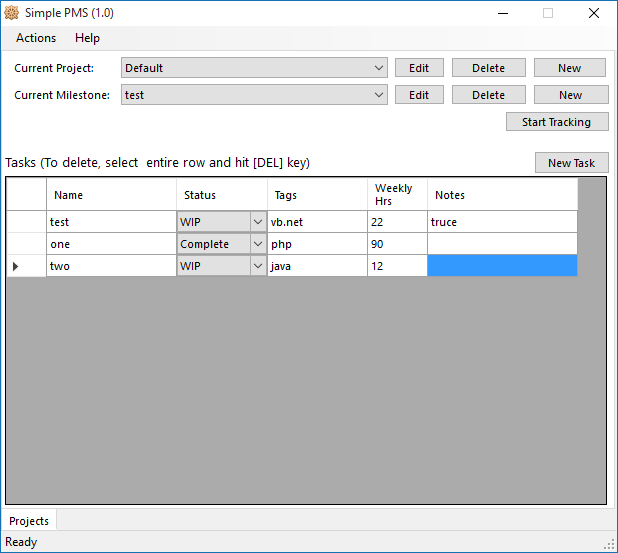

# Simple PMS

Simple PMS is a Project Management application for individual freelancers, hobbyists, students, etc.

# Technology

Runs on any Windows OS where .NET Framework 4.0 (or above) is installed, built with C# (WinForms) technology.

# Features

- Create and track projects, milestones and tasks.
- Time tracking with system tray icon.
- Create and track ad-hoc notes.
- Create and track hierarchical notes (mind-maps).

# Usage

The SimplePMS paradigm divides a project's work details into projects, milestones and tasks. Projects have a start and end date as well as status (Pending/WIP/Complete). It also has a category (Work/Study/Other). This model is simple enough to implement most typical errands such as an online course taken or working on a side project such as this!

A project can have one or more milestones and each milestone can have one or more tasks. Typical milestones and tasks for this one (Development of SimplePMS app) might include:

1. Analysis
	- Study the technical feasibility.
2. Development
	- Create a github repository.
	- Create Visual C# Solution.
	- Coding GUI and components.
3. Testing
	- Perform unit testing using nunit.
4. Bug Fixing
	- Track Github issue tracker.

# Third party components

- Images/Icons by [Yusuke Kamiyamane](https://p.yusukekamiyamane.com/) - Creative Commons 3 License.
- SQLite .NET Driver by [System.net.sqlite.org](https://system.data.sqlite.org/) - Microsoft Public License, MSPL.

# Installation

Installation is very easy, just grab the latest build [from here](https://github.com/prahladyeri/simplepms/releases/latest), extract the ZIP archive to a folder on your computer and start simplepms.exe.

# Build

Solution can be opened in any recent Visual Studio IDE including Express and Community Editions. Just download and add a reference to [System.Data.SQLite.dll](https://system.data.sqlite.org/) and you should be able to build the solution. When the app runs, it creates the database file (`pms.db`) if it doesn't exist already.

Right now, the project is in the analysis and requirements gathering stage. I'll keep updating the repo as and when things progress. If you have any thoughts on schema, features, technology, etc., feel free to shoot them through the discussion pane!
